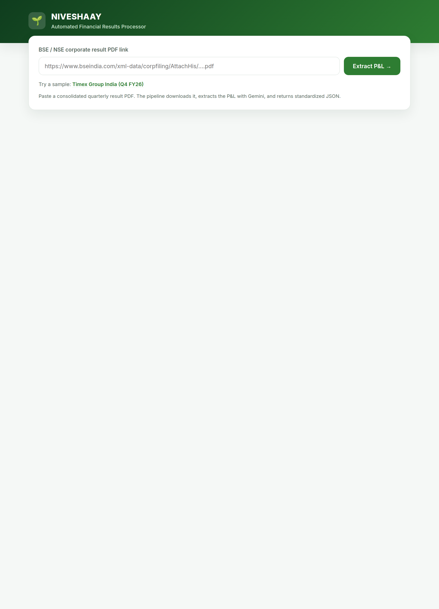
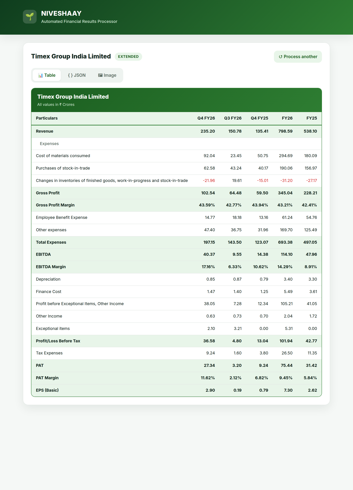
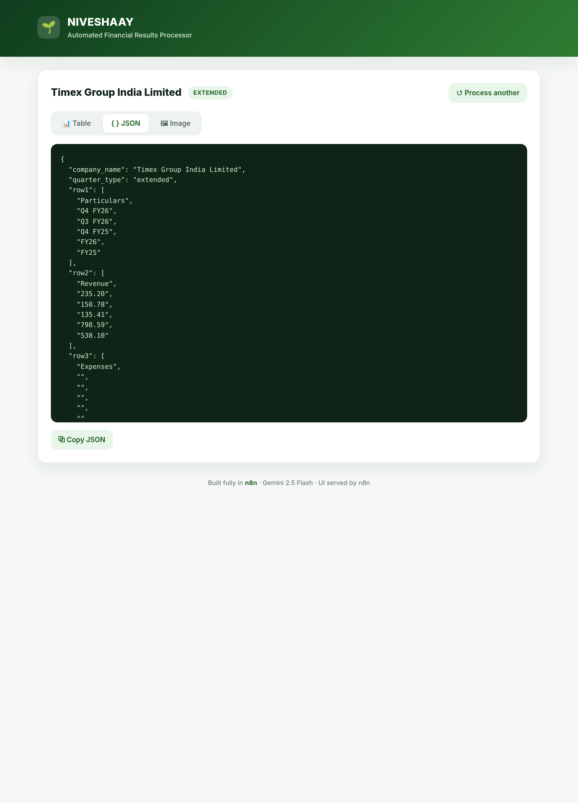
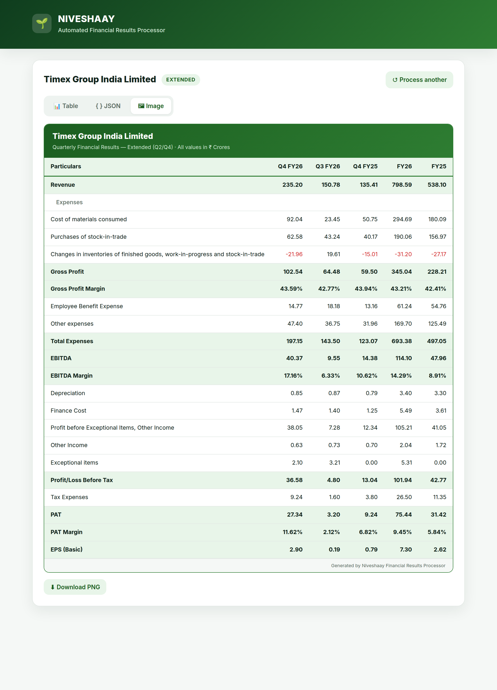
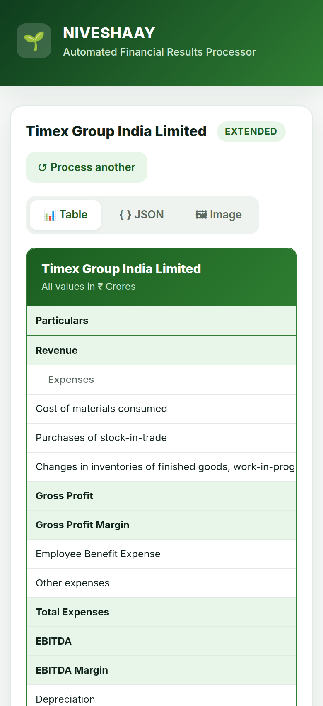

# Niveshaay — Automated Financial Results Processing Pipeline

Paste a BSE/NSE corporate-result **PDF link** → the pipeline downloads the PDF,
sends it to **Google Gemini 2.5 Flash** with a fixed extraction prompt, and returns
a **standardized P&L JSON** (calculated margins, EBITDA, PAT, EPS…). A polished web
UI shows the result as a **Table**, raw **JSON** (copyable), and a downloadable
**Image** (PNG).

> **Built fully in n8n.** A single n8n workflow both **serves the UI** and **runs the
> processing** — no separate frontend, no backend, no other services.
>
> - `GET  /webhook/ui`          → serves the web app (HTML/CSS/JS, from `ui.html`)
> - `POST /webhook/process-pdf` → validate → download PDF → Gemini → parse → **JSON**

## Screenshots

| Landing | Table | JSON | Image |
|---|---|---|---|
|  |  |  |  |

Responsive (mobile — the wide P&L table scrolls horizontally):



## What it does

1. Open the n8n-served page at **`/webhook/ui`** and paste a `.pdf` link → **Extract P&L**.
2. The page shows a staged loading animation while the workflow runs.
3. Workflow: **validate URL → download PDF → base64 → Gemini 2.5 Flash → parse JSON**.
4. The result appears in three tabs:
   - **📊 Table** — styled green P&L (like the iValue sample), negatives in red.
   - **{ } JSON** — pretty, with **Copy JSON**.
   - **🖼 Image** — the P&L card with **Download PNG** (rendered in-browser via html2canvas).
5. **Process another** resets; errors (bad link, no P&L, etc.) show a clear card.

## Architecture

```
                  ┌──────────────── single n8n workflow ─────────────────┐
  Browser ──GET /webhook/ui──▶  Webhook (GET) ─▶ Respond (HTML = ui.html) │  → serves the UI
          ◀───────── HTML ──────                                          │
          ──POST /webhook/process-pdf──▶ Webhook (POST)                    │
                                          → Validate → Download PDF        │
                                          → Prepare Gemini → Call Gemini   │
                                          → Parse → Respond (JSON)         │
          ◀──────── { success, data } ───                                 │
                  └───────────────────────────────────────────────────────┘
                                   │ ($env.GEMINI_API_KEY)
                                   ▼
                         Google Gemini 2.5 Flash
```

The UI and the API are the **same origin** (both served by n8n), so the page's
`fetch('/webhook/process-pdf')` needs no CORS setup. The image is rendered
client-side, so n8n needs **no Chromium/Puppeteer** for the core app.

Single source of truth for extraction logic: **`prompt.md`** (the exact task prompt).
`tools/build-workflow.js` embeds `prompt.md` + `ui.html` into `workflow.json`; no
secret is baked in (the Gemini node uses `{{ $env.GEMINI_API_KEY }}`).

## Caching

Submitting the **same PDF URL** again skips the download **and the Gemini call**.
The workflow keeps a result cache in n8n **workflow static data**
(`$getWorkflowStaticData('global')`) — pure n8n, no external store — with a **7-day
TTL**. Flow: `Validate → Check Cache → Is Cached?` → on a **hit** it responds instantly
with `{ "cached": true, ... }` (zero Gemini cost) and the UI shows a **⚡ Cached** badge;
on a **miss** it runs the full pipeline and `Write Cache` stores the result before
responding with `cached:false`.

## Prerequisites

- **Docker.** The `docker compose` v2 plugin is recommended; if it's missing,
  `setup.sh` automatically falls back to a plain `docker run` for the core app.
  (The optional WhatsApp profile still needs Compose.)
- A **Google Gemini API key** — <https://aistudio.google.com/apikey>.

## Setup & run

> **Quick start (one command):** `cp .env.example .env` and set `GEMINI_API_KEY`, then
> **`./setup.sh`** (core: UI + PDF→Gemini→JSON + cache) or **`./setup.sh whatsapp`**
> (also brings up **postgres + redis + evolution + image-service** for WhatsApp image
> delivery). `setup.sh` builds/starts the stack, **imports + activates** the workflow,
> and in `whatsapp` mode creates the Evolution instance and prints the QR-link + group-JID
> steps. The manual steps below are the same thing, broken out.

### 1. Configure the key

```bash
cp .env.example .env
# edit .env → set GEMINI_API_KEY=...
```

`workflow.json` is **secret-free** (uses `{{ $env.GEMINI_API_KEY }}`); never commit `.env`.

### 2. Start everything (one command)

```bash
./setup.sh
```

It starts n8n, waits for it, **imports _and activates_** the workflow, restarts to
register the webhooks, and prints the URL. Idempotent — re-run it any time to
re-import after editing `prompt.md` / `ui.html` (run `node tools/build-workflow.js` first).
Works with or without the Compose plugin: if `docker compose` is missing it falls
back to a plain `docker run` (same image, env, and `n8n_data` volume).

Stop it later with `docker compose down` (or, on the `docker run` path, `docker rm -f niveshaay_n8n`).

<details><summary>…or do the same steps by hand</summary>

Import + activate must happen with n8n **stopped** — its SQLite DB can't be written
by the CLI while the server holds it (you'd hit `SQLITE_BUSY`). Use a one-shot container:

```bash
# Compose:
docker compose run --rm --no-deps -v "$PWD/workflow.json":/tmp/workflow.json:ro \
  n8n import:workflow --input=/tmp/workflow.json
docker compose run --rm --no-deps n8n update:workflow --id=niveshaayfinres1 --active=true
docker compose up -d n8n                                              # start it (registers webhooks)

# docker run (no Compose):
docker run --rm -v n8n_data:/home/node/.n8n -v "$PWD/workflow.json":/tmp/workflow.json:ro \
  n8nio/n8n:latest import:workflow --input=/tmp/workflow.json
docker run --rm -v n8n_data:/home/node/.n8n n8nio/n8n:latest update:workflow --id=niveshaayfinres1 --active=true
docker run -d --name niveshaay_n8n -p 5678:5678 --env-file .env \
  -e N8N_BLOCK_ENV_ACCESS_IN_NODE=false -v n8n_data:/home/node/.n8n n8nio/n8n:latest
```

> The compose file sets **`N8N_BLOCK_ENV_ACCESS_IN_NODE=false`** — required, or the
> Gemini node fails with *"access to env vars denied"* (n8n blocks `$env` by default).
> You can also open <http://localhost:5678>, import `workflow.json`, and toggle **Active**
> (the editor asks you to create a local owner account the first time).
</details>

### 3. Use it

Open **<http://localhost:5678/webhook/ui>**, paste a BSE/NSE consolidated-result PDF
link, and click **Extract P&L**. Or hit the API directly:

```bash
curl -X POST http://localhost:5678/webhook/process-pdf \
  -H 'Content-Type: application/json' \
  -d '{"pdfUrl":"https://www.bseindia.com/xml-data/corpfiling/AttachHis/<file>.pdf"}'
```

See `samples/` for example outputs.

## Error handling

| Case | API status | UI |
|------|-----------|----|
| Empty / non-`https` / non-`.pdf` | 400 | "Invalid input" with the reason |
| Download failed / expired / blocked | 502 | error card |
| Gemini API/network failure | 502 | error card |
| No P&L in the PDF | 400 | "No P&L statement found in this PDF" |
| Gemini returned non-JSON | 502 | "Failed to parse…" |

## JSON output contract (from `prompt.md`)

- `company_name`, `quarter_type` (`standard` | `extended`), `row1..rowN`.
- **Q1/Q3 → standard** (4 cols). **Q2 → extended** (6 cols, +H1). **Q4 → extended** (6 cols, +FY).
- Consolidated only (standalone if no consolidated); no P&L at all → `no pnl found`.
- Values are strings in Rs Crores, 2 decimals; margins carry `%`; `-`/null→0 except EPS.
- Calculated when missing: Gross Profit, GP Margin, Total Expenses, EBITDA, EBITDA
  Margin, Profit-before-Exceptional, PBT, PAT, PAT Margin. EPS uses the printed value.

## Project structure

```
.
├── README.md
├── setup.sh                # one command: start n8n + import + activate + print URL
├── .env.example            # copy → .env (GEMINI_API_KEY)
├── docker-compose.yml      # n8n (stock image) + optional evolution/postgres/image-service (whatsapp profile)
├── workflow.json           # the importable n8n workflow — serves UI + JSON API (secret-free)
├── ui.html                 # the web app n8n serves at /webhook/ui
├── prompt.md               # the exact Gemini extraction prompt (single source of truth)
├── tools/build-workflow.js # regenerates workflow.json from prompt.md + ui.html
├── samples/                # real outputs (standard + extended) + notes
└── image-service/          # ONLY for the optional WhatsApp image (Puppeteer PNG renderer)
```

## WhatsApp delivery (Evolution API)

On a **fresh extraction** the workflow renders the P&L as a PNG and posts it to a
WhatsApp group. The branch is `Success Response → Prepare Send → WhatsApp Configured?
→ Render Image → Send to WhatsApp`:

- **Render Image** → `POST {IMAGE_SERVICE_URL}/generate-image` — the small Puppeteer
  service bundled in `image-service/` that turns the P&L JSON into the same styled
  green PNG the UI shows, and returns `{ base64 }`.
- **Send to WhatsApp** → `POST {EVOLUTION_API_URL}/message/sendMedia/{EVOLUTION_INSTANCE}`
  (header `apikey`) with `{ number: WHATSAPP_GROUP_JID, mediatype:"image", media:<base64>, caption }`.

It only runs when `WHATSAPP_GROUP_JID` is set (empty ⇒ skipped), and **cache hits do not
re-send** (avoids spamming the group on repeat views).

### One-time setup

**1. Run the services** (Evolution API + Postgres + **Redis** + the image-service). Either:

```bash
# A) Compose-free (no plugin needed): runs them on a shared docker network and
#    connects n8n to it. Evolution admin is on :8081 (leaves host :8080 free).
./setup.sh whatsapp

# B) With the Compose v2 plugin: the `whatsapp` profile brings them up alongside n8n.
#    Evolution admin is on :8080.
docker compose --profile whatsapp up -d   # postgres + redis + evolution (8080) + image-service (3001)
```

> Evolution v2 **requires Redis** — both paths now start a `redis` container and set
> `CACHE_REDIS_ENABLED=true` / `CACHE_REDIS_URI=redis://redis:6379/8`. Without it Evolution
> crash-loops on `redis disconnected` and exits.

Either way n8n reaches the services by name (`http://evolution:8080`, `http://image-service:3001`).
The steps below use **`$ADMIN`** for the admin base URL — set it to match the path you chose:

```bash
ADMIN=http://localhost:8081    # path A (./setup.sh whatsapp);  use :8080 for path B
KEY=change-me                  # = EVOLUTION_API_KEY in .env
```

> Path A already creates the `niveshaay` instance for you — you only need the QR scan (step 2).

**2. Link WhatsApp (QR scan — must be done by a human):**

```bash
# (path B only) create the instance — path A's ./setup.sh whatsapp already did this:
curl -X POST $ADMIN/instance/create -H "apikey: $KEY" \
  -H 'Content-Type: application/json' \
  -d '{"instanceName":"niveshaay","integration":"WHATSAPP-BAILEYS","qrcode":true}'
# scan the QR at the manager UI:  $ADMIN/manager   (open instance "niveshaay")
#   → WhatsApp: Settings → Linked Devices → Link a device
# confirm it linked:
curl $ADMIN/instance/connectionState/niveshaay -H "apikey: $KEY"
#   → {"instance":{"instanceName":"niveshaay","state":"open"}}   (open = linked)
```

**3. Get the WhatsApp GROUP JID** — the value `WHATSAPP_GROUP_JID` needs:

```bash
curl -H "apikey: $KEY" \
  "$ADMIN/group/fetchAllGroups/niveshaay?getParticipants=false"
```

It returns an array; each group has an `id` like `120363XXXXXXXXXXXX@g.us` (that **is**
the JID) and a `subject` (the group name). Pick the one you want:

```json
[ { "id": "120363407XXXXXXXXX@g.us", "subject": "Niveshaay Test" }, ... ]
```

> Tips: the linked account must already be a **member** of the group. This endpoint can
> be slow (Baileys fetches metadata) — give it 30–60s. For a clean demo, make a dedicated
> group (e.g. "Niveshaay Test"), add yourself, then read its JID here.

**4. Set the group JID & apply:**

`.env` already ships these (n8n reaches the services by name on both paths), so
`WHATSAPP_GROUP_JID` is usually the only value you change:

```bash
WHATSAPP_GROUP_JID=120363407XXXXXXXXX@g.us   # ← the group to post to
EVOLUTION_API_URL=http://evolution:8080
EVOLUTION_API_KEY=change-me
EVOLUTION_INSTANCE=niveshaay
IMAGE_SERVICE_URL=http://image-service:3001
```

Apply the change so n8n picks up the new env:

```bash
# Compose path:     docker compose up -d n8n
# docker run path:  docker rm -f niveshaay_n8n && ./setup.sh whatsapp
#   (a plain `docker restart` does NOT re-read --env-file)
```

Now submit a (new) PDF in the UI → the P&L image is posted to that group.
(`sendText` is an alternative if you prefer a text summary over an image.)

## Security

- The Gemini key lives only in `.env` (gitignored), referenced via `{{ $env… }}`.
- `workflow.json` is secret-free; verify: `git grep -nE 'AIza[0-9A-Za-z_-]{20,}'` → no matches.

## Verified

Run live on **n8n 2.22.5** against a real BSE filing
(`AttachHis/ff349118-…-fdbcbf36acb4.pdf`): the UI is served at `/webhook/ui`, and a
POST to `/webhook/process-pdf` returns standardized JSON for **Timex Group India Ltd
(Q4 FY26, extended)** in ~55s. Spot-checked calculations tie out (Gross Profit 102.54,
EBITDA 40.37 / 17.16%, PAT 27.34 / 11.62%). See
`samples/sample-4-extended-timex-q4fy26.json`.

## Troubleshooting

- **"access to env vars denied"** → set `N8N_BLOCK_ENV_ACCESS_IN_NODE=false` (compose does this).
- **`SQLITE_BUSY: database is locked` on import** → you ran `n8n import:workflow` (via
  `docker exec`) while n8n was running; the live server holds the SQLite DB. Import via a
  one-shot container with n8n **stopped** (see step 2's "by hand" block). `./setup.sh` does this.
- **Webhook 404 right after start** → the workflow must be **Active**. `import:workflow`
  alone leaves it inactive — activate it (`n8n update:workflow --id=niveshaayfinres1
  --active=true`) before starting n8n. `./setup.sh` does both for you.
- **BSE link "download failed"** → BSE/NSE attachment URLs expire; re-copy a fresh link.
- **Large PDF** → Gemini node timeout is 120s; a ~2.6 MB PDF takes ~55s.
- **html2canvas not loading** (image download) → the page loads it from a CDN; needs internet.
